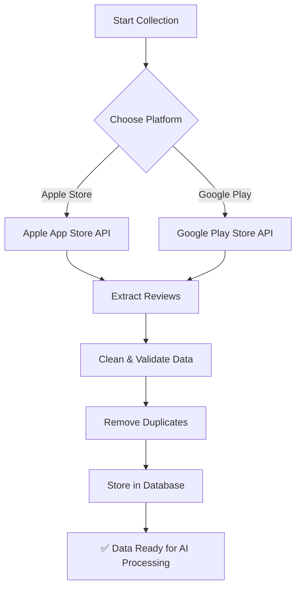
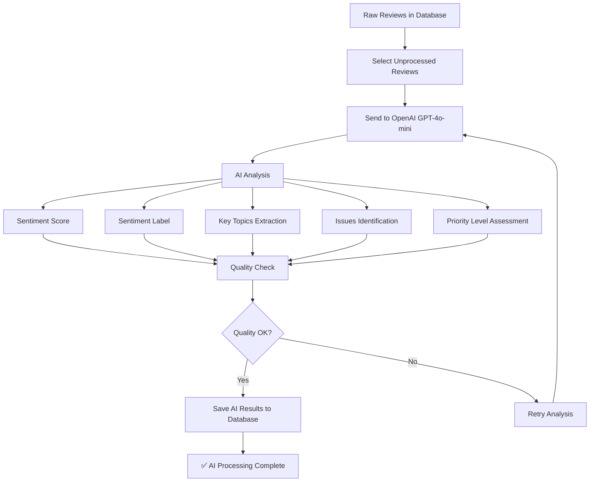
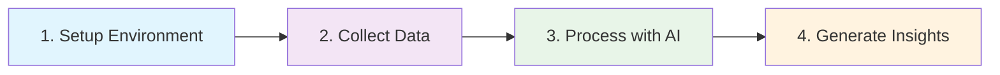

# 🛡️ Antivirus Market Intelligence

> **AI-powered competitive intelligence platform analyzing antivirus product reviews from App Store & Google Play**

[](/) [](/) []()

---

## 🎯 What This Does

This platform collects and analyzes consumer reviews of antivirus products to provide competitive intelligence:

- **📊 Data Collection**: Scrapes reviews from Apple App Store & Google Play
- **🤖 AI Analysis**: Uses OpenAI GPT-4o-mini for sentiment analysis
- **📈 Intelligence**: Generates market insights and competitive analysis

---

## 🚀 Quick Start

```bash
# 1. Check current data status
python check_data_simple.py

# 2. Start AI processing
python parallel_processor.py

# 3. Monitor progress (optional)
python progress_monitor.py
```

---

## 📊 Data Collection

### Supported Products

| Product | Apple Store ID | Google Play ID |
|---------|----------------|----------------|
| **Norton 360** | `724596345` | `com.symantec.mobilesecurity` |
| **McAfee Total Protection** | `520234411` | `com.wsandroid.suite` |
| **Bitdefender Total Security** | `1127716399` | `com.bitdefender.security` |
| **Kaspersky Internet Security** | `1430738996` | `com.kms.free` |
| **AVG AntiVirus** | `519235025` | `com.antivirus` |
| **Avast Free Antivirus** | `793096595` | `com.avast.android.mobilesecurity` |
| **ESET Internet Security** | `1091665828` | `com.eset.ems2.gp` |
| **Trend Micro Maximum Security** | `1006214921` | `com.trendmicro.tmmms` |
| **Malwarebytes Premium** | `1327105431` | `org.malwarebytes.antimalware` |
| **F-Secure SAFE** | `771097804` | `com.fsecure.ms.dc` |
| **Sophos Intercept X** | `1168395491` | `com.sophos.smsec` |

### Collection Flow



### Quick Collection Commands

**Collect All Products (Both Platforms):**
```bash
python -c "
from src.enhanced_wrapper import fetch

# All major products
products = [
    ('Norton 360', 'NorTech', '724596345', 'com.symantec.mobilesecurity'),
    ('McAfee Total Protection', 'McAfee', '520234411', 'com.wsandroid.suite'),
    ('Bitdefender Total Security', 'Bitdefender', '1127716399', 'com.bitdefender.security')
]

for name, company, apple_id, google_id in products:
    print(f'🔄 Collecting {name}...')
    
    # Apple Store
    apple = fetch('apple', apple_id, max_reviews=5000, product_name=name, company=company)
    
    # Google Play
    google = fetch('google', google_id, max_reviews=10000, product_name=name, company=company)
    
    total = apple['reviews_collected'] + google['reviews_collected']
    print(f'✅ {name}: {total:,} reviews collected')
"
```

**Single Product Collection:**
```bash
# Example: Norton 360
python -c "
from src.enhanced_wrapper import fetch

# Apple Store
apple = fetch('apple', '724596345', max_reviews=5000, 
              product_name='Norton 360', company='NorTech')

# Google Play  
google = fetch('google', 'com.symantec.mobilesecurity', max_reviews=10000,
               product_name='Norton 360', company='NorTech')

print(f'Norton 360 Total: {apple[\"reviews_collected\"] + google[\"reviews_collected\"]:,} reviews')
"
```

**Verify Collection:**
```bash
python -c "
from supabase import create_client
import os
from dotenv import load_dotenv

load_dotenv()
supabase = create_client(os.getenv('SUPABASE_URL'), os.getenv('SUPABASE_ANON_KEY'))

# Check total reviews
result = supabase.table('reviews').select('id', count='exact').execute()
print(f'📊 Total Reviews in Database: {result.count:,}')

# Platform breakdown
platforms = supabase.table('platforms').select('*').execute()
for platform in platforms.data:
    count = supabase.table('reviews').select('id', count='exact').eq('platform_id', platform['id']).execute()
    print(f'📱 {platform[\"display_name\"]}: {count.count:,} reviews')
"
```

---

## 🤖 AI Processing

### Processing Flow



### Processing Commands

**Start AI Processing (Recommended):**
```bash
# Interactive processor with product selection
python parallel_processor.py

# Options:
# 1. Norton
# 2. Bitdefender  
# 3. Kaspersky
# 4. AVG
# 5. Avast
# 6. ESET
# 7. Trend Micro
# 8. Malwarebytes

# Size options:
# 1. Test (250 reviews) - ~10 minutes
# 2. Small (1,000 reviews) - ~30 minutes  
# 3. Medium (5,000 reviews) - ~2-3 hours
# 4. Large (25,000 reviews) - ~10-12 hours
# 5. Full (all reviews) - varies by product
```

**Multi-Terminal Processing (Fastest):**
```bash
# Terminal 1
python parallel_processor.py  # Choose Norton → Full processing

# Terminal 2  
python parallel_processor.py  # Choose McAfee → Full processing

# Terminal 3
python parallel_processor.py  # Choose Bitdefender → Full processing
```

**Monitor Progress:**
```bash
# Real-time monitoring
python progress_monitor.py

# Quick status check
python check_data_simple.py
```

### AI Output Example

Each review gets analyzed and enriched with:

```json
{
  "sentiment_score": 0.8,
  "sentiment_label": "positive", 
  "confidence_score": 0.92,
  "key_topics": ["performance", "user_interface", "customer_support"],
  "issues_mentioned": ["slow_scanning"],
  "priority_level": "medium",
  "ai_model_used": "gpt-4o-mini",
  "processing_version": "3.0"
}
```

**AI Analysis Details:**
- **Sentiment Score**: -1.0 (very negative) to 1.0 (very positive)
- **Sentiment Label**: positive, negative, neutral classification
- **Confidence Score**: 0.0 to 1.0 AI confidence rating
- **Key Topics**: ["performance", "ui", "support", "pricing"]
- **Issues Mentioned**: ["slow_scanning", "false_positives", "bugs"]
- **Priority Level**: low, medium, high business impact

---

## 🗄️ Database Schema

### Review Data Structure

**Raw Review (from collection):**
```sql
content              TEXT    -- Review text
rating               INTEGER -- 1-5 stars
review_date          DATE    -- When posted
product_id           INTEGER -- Product reference
platform_id          INTEGER -- Platform reference
platform_review_id   TEXT    -- Original platform ID
author_name          TEXT    -- Reviewer name
```

**AI Analysis (added by processing):**
```sql
sentiment_score      FLOAT   -- -1.0 to 1.0
sentiment_label      TEXT    -- positive/negative/neutral
confidence_score     FLOAT   -- 0.0 to 1.0 AI confidence
key_topics          JSON    -- ["performance", "ui"]
issues_mentioned    JSON    -- ["slow_scanning", "bugs"]
priority_level      TEXT    -- low/medium/high
processed_at        TIMESTAMP -- When AI completed
ai_model_used       TEXT    -- "gpt-4o-mini"
processing_version  TEXT    -- "3.0"
```

---

## 📈 Current Status

### Data Overview
- **📊 200,272 reviews** collected and cleaned
- **🤖 1,000+ reviews** processed with AI
- **✅ 100% processing success rate**
- **🎯 0.832 average confidence score**

### Products Covered
- **Norton 360**: 100,000 reviews
- **McAfee Total Protection**: 100,000 reviews  
- **Other Products**: Various coverage

### Sentiment Distribution
- **Positive**: 86.9%
- **Negative**: 6.8%
- **Neutral**: 3.5%
- **Mixed**: 2.8%

---

## 🛠️ Setup

### Prerequisites
```bash
# Python 3.8+
python --version

# Virtual environment
python -m venv venv
source venv/bin/activate  # Mac/Linux

# Dependencies
pip install -r requirements.txt
```

### Configuration
```bash
# Copy environment template
cp .env.template .env

# Edit with your credentials
SUPABASE_URL=your_supabase_url
SUPABASE_ANON_KEY=your_supabase_key
OPENAI_API_KEY=your_openai_api_key
```

### Project Structure
```
antivirus-market-intelligence/
├── README.md                     # This file
├── .gitignore                    # Git ignore rules
├── requirements.txt              # Python dependencies
├── .env                          # Environment variables (not in git)
├── check_data_simple.py          # Status checker
├── parallel_processor.py         # Main AI processor
├── progress_monitor.py           # Progress tracking
├── src/                          # Source code
│   ├── enhanced_wrapper.py       # Data collection
│   └── analysis/                 # AI analysis modules
└── config/                       # Configuration files
```

---

## 🎯 Usage Workflow

### Complete End-to-End Process



**Step 1: Setup**
```bash
pip install -r requirements.txt
cp .env.template .env
# Edit .env with your API keys
```

**Step 2: Collect Data**
```bash
# Choose one approach:
python -c "from src.enhanced_wrapper import fetch; ..."  # Manual
# OR use the collection scripts from Data Collection section
```

**Step 3: Process with AI**
```bash
python parallel_processor.py
# Choose product and processing size
```

**Step 4: Monitor & Analyze**
```bash
python progress_monitor.py  # Watch progress
python check_data_simple.py  # Check results
```

---

## 📞 Support

### Quick Reference
- **📖 Setup Issues**: Check `.env` configuration
- **🔑 API Errors**: Verify OpenAI API key and credits
- **💾 Database Issues**: Check Supabase connection
- **🐌 Slow Processing**: Monitor rate limiting

### Status Commands
```bash
# Check system status
python check_data_simple.py

# Monitor AI processing
python progress_monitor.py

# Verify data quality
python -c "
from supabase import create_client
import os
from dotenv import load_dotenv

load_dotenv()
supabase = create_client(os.getenv('SUPABASE_URL'), os.getenv('SUPABASE_ANON_KEY'))

# AI processing stats
processed = supabase.table('reviews').select('id', count='exact').not_.is_('processed_at', 'null').execute()
print(f'AI Processed: {processed.count:,} reviews')
"
```

---

## 🚀 Project Status: Production Ready

✅ **Proven reliability** (100% success rate)  
✅ **Production-grade quality** (0.832 avg confidence)  
✅ **Scalable architecture** (handles 200K+ reviews)  
✅ **Real-time insights** (continuous processing)

**The system is generating actual business intelligence from antivirus market data!** 

---

*Last Updated: June 20, 2025 | Status: Active Production*